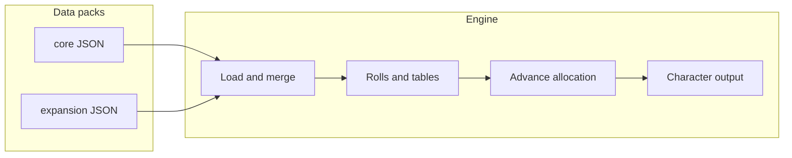

# WFRP 4e character generator — rules alignment and extensibility

> **Repository copy of the product plan.** This file was carried over from Cursor planning so future work (PDF cross-checks, new books, refactors) has a single place to read intent and update direction. **Edit this document** when scope or architecture changes; it is not auto-synced from Cursor.

**Cursor-driven development:** Much of the current design and implementation was iterated with [Cursor](https://cursor.com) (AI-assisted editing and planning). Treat this plan plus git history as the source of truth for *why* the layout looks the way it does.

---

## Snapshot metadata (from original plan)

- **Name:** WFRP4e Chargen Overhaul  
- **Overview:** Replace the monolithic Python 2 script with a Python 3, data-driven character engine that follows core WFRP 4e creation (rolls, species modifiers, derived stats, wounds/Fate/Movement, career tables, automated advance allocation), outputs resolved talents with descriptions, and loads mergeable data packs so future PDFs can add content without rewriting logic.

Original todos (all completed in the first implementation pass):

| ID | Content |
|----|---------|
| add-pdf-path | Use core rulebook at `z:\gback\wf.pdf` (`WFRP_RULEBOOK_PDF`); optional extraction script |
| data-schema | JSON for species, careers, random talents, career tables, talent catalog |
| engine-py3 | Python 3 package: rolls, modifiers, wounds/Fate/Movement, allocations, OR choices |
| fix-tables | d100 career tables 1–100 per species; fix Human Warrior / Elf issues |
| talent-output | Talent catalog + details on character sheet |
| tests-readme | Tests and README for packs |

---

## Current state (historical — legacy `WFRP.py`)

- **Python 2** (`print` statements); does not run cleanly on modern Python without porting.
- **Hard bugs**: Stat line mislabels **Int / WP** (both use `cattributes[7]`; WP should be index 8). `ctalents=racialtalents(dhundred)` passes the **function** `dhundred`, not a roll — random human talents are broken. Human **Warriors** tier used impossible ranges (`0 <= entropy <= 0` for Slayer) and mis-assigned **100** vs **Slayer** / **Warrior Priest**; several **Elf / copy-paste** branches had the same pattern, so some d100 results could leave `career` **undefined** or wrong.
- **Rules gaps**: Species **characteristic modifiers** were only described as strings, never applied. **Wounds**, **Fate**, **Resilience**, **Movement**, and **starting XP** were placeholders. No implementation of **40 class skill advances** (max 10 each), **5 characteristic advances** on career attributes, or **one career talent** choice.
- **Data quality**: Inconsistent storage (some racial “skills” as one giant string). Typos in career data (e.g. Hedge Witch `Trade (Charms`, Scout `Ag` / duplicated text in skills, `Lightning Re exes`, `In- ghter`, `Consume Alchohol`).
- **Superseded by** `wfrp_chargen/` + `data/packs/core/` (see [README](../README.md)).

## Core rulebook PDF location

- **Canonical path (example machine):** `z:\gback\wf.pdf`
- **Environment variable:** `WFRP_RULEBOOK_PDF` — set to your PDF path. The script `scripts/extract_rulebook_text.py` reads this variable.
- Earlier `wh.pdf` was not found on the dev box; **`wf.pdf`** was verified as the rulebook file.

## Target behavior (full auto, rules-legal)

Per core book character creation (cross-check ranges and formulas against your PDF):

1. **Characteristics**: Roll each as **2d10 + 20**; apply **species modifiers**; compute **bonuses** (tens digit of final stat, WFRP 4e rounding).
2. **Derived profile**: **Starting Wounds** and **Movement** from species + formula in the book. **Fate** and **Resilience** from species table.
3. **Species**: d100 species roll (**verify** vs PDF).
4. **Career**: d100 on the **species-specific** career table; every **1–100** outcome maps to exactly one career and class.
5. **Species talents**: Roll or resolve choices (e.g. **Savvy OR Suave**, **Read/Write or …**); **Reiklander** three rolls on **Random Talents** (reconcile duplicate Luck bands with the book).
6. **Career package**: **5** characteristic advances across the career’s three listed stats; **40** skill advances across **8** class skills (**max 10** each); **one** career talent from four (random).
7. **Species skills**: Starting skill advance rules (e.g. 3×5 and 3×3 advances on species lists).
8. **Output**: Structured report (text or JSON): final characteristics, bonuses, wounds, Fate, Resilience, Movement, skills with **final values**, trappings, status, **all talents** with **details**.

## Extensibility (“room for other PDFs”)

- `wfrp_chargen/` — engine.
- `data/packs/core/` — `species.json`, `careers.json`, `random_talents.json`, `career_tables.json`, `talents_catalog.json`.
- `data/packs/<expansion_id>/` — same shapes; loader **merges** packs (see README).

Optional **verification helper**: PDF path from env; extract text for **manual** diff against JSON.

## Talent details in output

- `talents_catalog.json`: **talent id** → `{ "name", "max", "tests", "effect" }` (and optional `"modifiers"` for sheet automation).
- Prefer **short paraphrased** mechanical summaries for public repos; private/local JSON may hold longer excerpts (respect copyright).

## Implementation notes

- **Python 3**; `requirements.txt` (e.g. `faker`, `pypdf`, `pytest`).
- Legacy `career_package` replaced by exported **JSON** careers + scripts to rebuild tables.
- **Tests**: Table coverage, allocation constraints (40/10/5).
- **README**: `python -m wfrp_chargen`, `WFRP_RULEBOOK_PDF`, expansion packs.

## Risk / dependency

Accurate **career tables and numbers** must match your PDF; validate **JSON tables + formulas** against `z:\gback\wf.pdf` (or `WFRP_RULEBOOK_PDF`), then keep code and data in sync.

## Follow-ups (for future plan revisions)

- PDF-verified d100 bands for every species vs Cubicle 7 tables.
- Extend `talent_effects.py` / catalog `modifiers` for full talent coverage.
- Optional: starting XP, corruption, detailed initiative if the table uses a different formula.
- UI or export formats (PDF character sheet) if desired.
